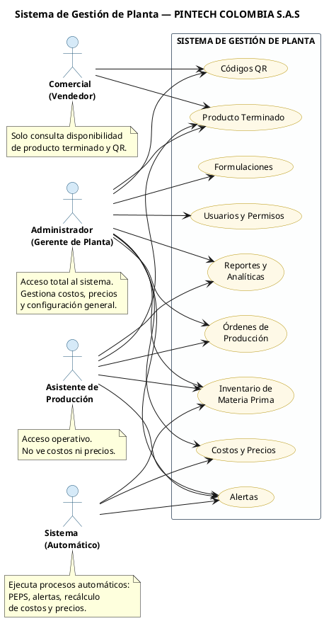
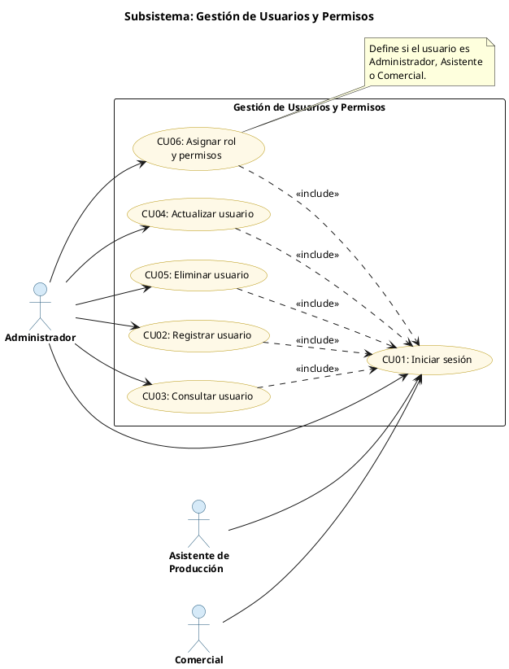
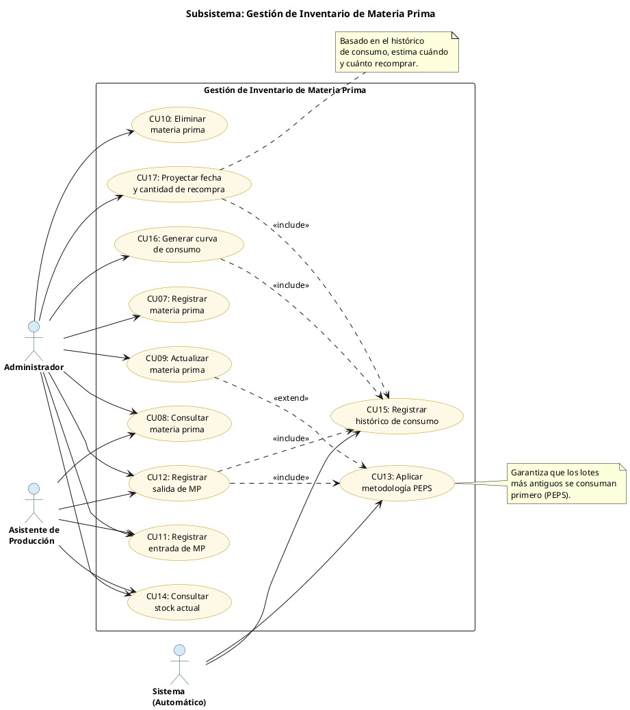
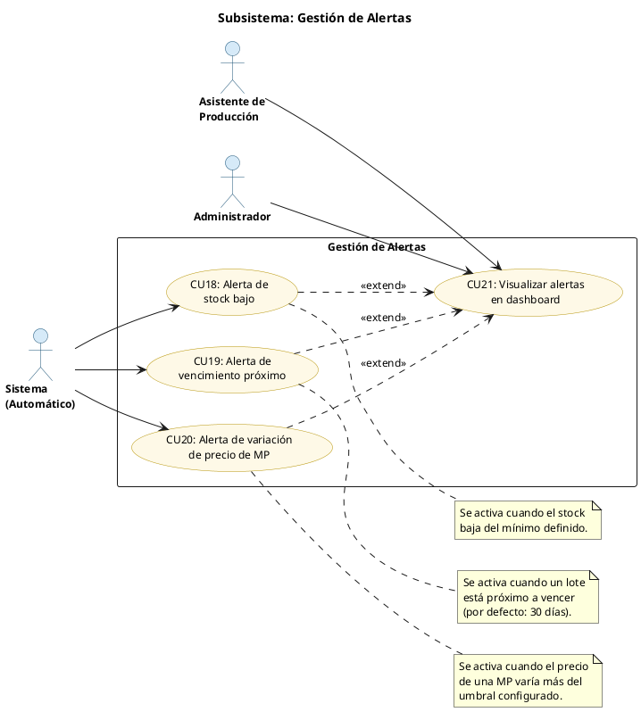
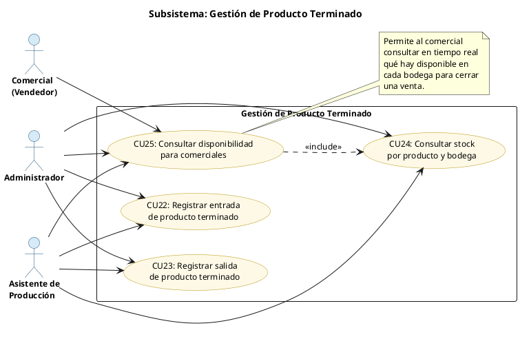
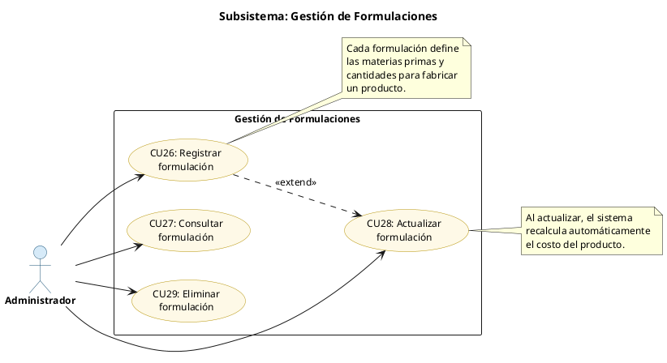
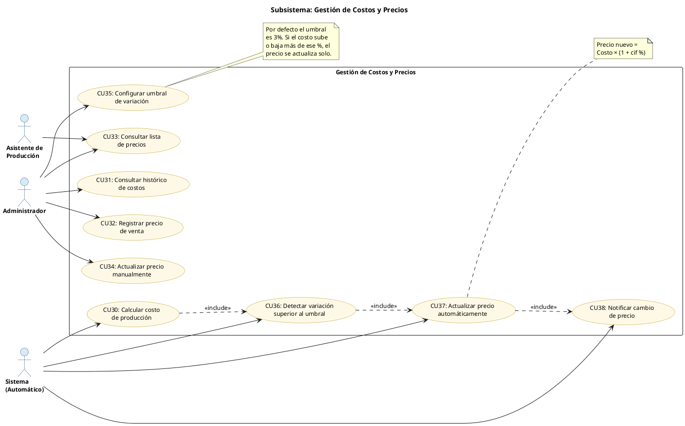
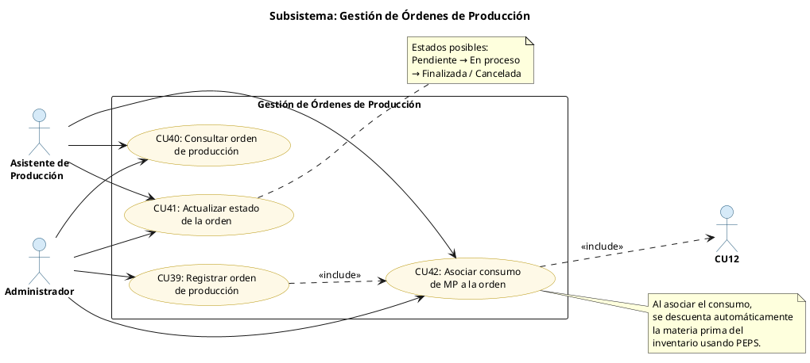
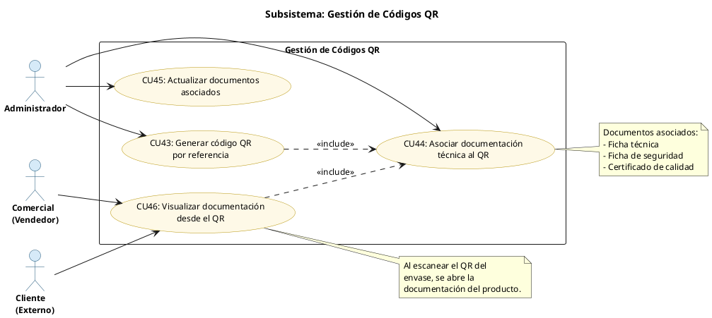
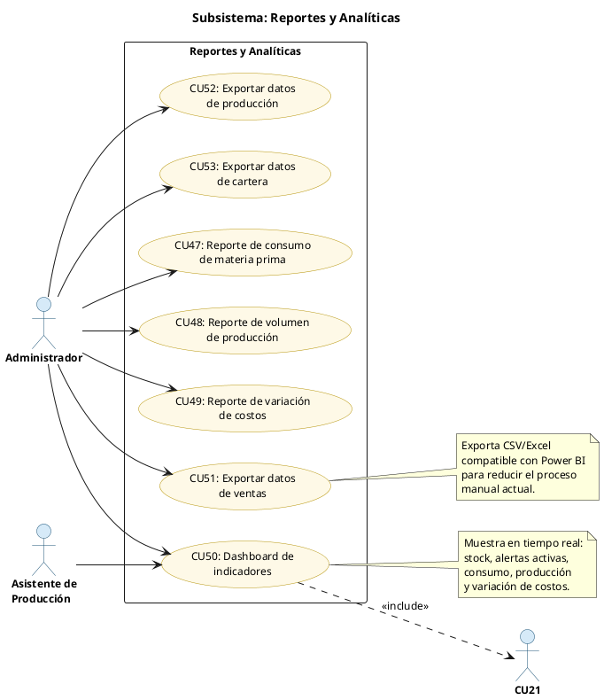

# Diagramas de Casos de Uso — Sistema Gestión de Planta
## PINTECH COLOMBIA S.A.S

---

## 1. Diagrama General del Sistema

> Muestra los tres perfiles de usuario y los subsistemas a los que cada uno tiene acceso.

---

## 2. Subsistema: Gestión de Usuarios y Permisos
**Casos de uso:** CU01 al CU06

| Código | Nombre | Actor |
|--------|--------|-------|
| CU01 | Iniciar sesión | Todos |
| CU02 | Registrar usuario | Administrador |
| CU03 | Consultar usuario | Administrador |
| CU04 | Actualizar usuario | Administrador |
| CU05 | Eliminar usuario | Administrador |
| CU06 | Asignar rol y permisos | Administrador |

---

## 3. Subsistema: Gestión de Inventario de Materia Prima
**Casos de uso:** CU07 al CU17

| Código | Nombre | Actor |
|--------|--------|-------|
| CU07 | Registrar materia prima | Administrador |
| CU08 | Consultar materia prima | Admin, Asistente |
| CU09 | Actualizar materia prima | Administrador |
| CU10 | Eliminar materia prima | Administrador |
| CU11 | Registrar entrada de materia prima | Admin, Asistente |
| CU12 | Registrar salida de materia prima | Admin, Asistente |
| CU13 | Aplicar metodología PEPS | Sistema |
| CU14 | Consultar stock actual | Admin, Asistente |
| CU15 | Registrar histórico de consumo | Sistema |
| CU16 | Generar curva de consumo | Administrador |
| CU17 | Proyectar fecha y cantidad de recompra | Administrador |

---

## 4. Subsistema: Gestión de Alertas
**Casos de uso:** CU18 al CU21

| Código | Nombre | Actor |
|--------|--------|-------|
| CU18 | Generar alerta de stock bajo | Sistema |
| CU19 | Generar alerta de vencimiento próximo | Sistema |
| CU20 | Generar alerta de variación de precio de MP | Sistema |
| CU21 | Visualizar alertas en dashboard | Admin, Asistente |

---

## 5. Subsistema: Gestión de Producto Terminado
**Casos de uso:** CU22 al CU25

| Código | Nombre | Actor |
|--------|--------|-------|
| CU22 | Registrar entrada de producto terminado | Admin, Asistente |
| CU23 | Registrar salida de producto terminado | Admin, Asistente |
| CU24 | Consultar stock por producto y bodega | Admin, Asistente |
| CU25 | Consultar disponibilidad para comerciales | Admin, Asistente, Comercial |

---

## 6. Subsistema: Gestión de Formulaciones
**Casos de uso:** CU26 al CU29

| Código | Nombre | Actor |
|--------|--------|-------|
| CU26 | Registrar formulación | Administrador |
| CU27 | Consultar formulación | Administrador |
| CU28 | Actualizar formulación | Administrador |
| CU29 | Eliminar formulación | Administrador |

---

## 7. Subsistema: Gestión de Costos y Precios
**Casos de uso:** CU30 al CU38

| Código | Nombre | Actor |
|--------|--------|-------|
| CU30 | Calcular costo de producción | Sistema |
| CU31 | Consultar histórico de costos | Administrador |
| CU32 | Registrar precio de venta | Administrador |
| CU33 | Consultar lista de precios | Admin, Asistente |
| CU34 | Actualizar precio manualmente | Administrador |
| CU35 | Configurar umbral de variación | Administrador |
| CU36 | Detectar variación de costo superior al umbral | Sistema |
| CU37 | Actualizar precio automáticamente | Sistema |
| CU38 | Notificar cambio de precio | Sistema |

---

## 8. Subsistema: Gestión de Órdenes de Producción
**Casos de uso:** CU39 al CU42

| Código | Nombre | Actor |
|--------|--------|-------|
| CU39 | Registrar orden de producción | Administrador |
| CU40 | Consultar orden de producción | Admin, Asistente |
| CU41 | Actualizar estado de orden | Admin, Asistente |
| CU42 | Asociar consumo de MP a la orden | Admin, Asistente |

---

## 9. Subsistema: Gestión de Códigos QR
**Casos de uso:** CU43 al CU46

| Código | Nombre | Actor |
|--------|--------|-------|
| CU43 | Generar código QR por referencia de producto | Administrador |
| CU44 | Asociar documentación técnica | Administrador |
| CU45 | Actualizar documentos asociados | Administrador |
| CU46 | Visualizar documentación desde QR | Cliente, Comercial |

---

## 10. Subsistema: Reportes y Analíticas
**Casos de uso:** CU47 al CU53

| Código | Nombre | Actor |
|--------|--------|-------|
| CU47 | Generar reporte de consumo de materia prima | Administrador |
| CU48 | Generar reporte de volumen de producción por período | Administrador |
| CU49 | Generar reporte de variación de costos | Administrador |
| CU50 | Visualizar dashboard de indicadores | Admin, Asistente |
| CU51 | Exportar datos de ventas para Power BI | Administrador |
| CU52 | Exportar datos de producción para Power BI | Administrador |
| CU53 | Exportar datos de cartera para Power BI | Administrador |

---

## Resumen General

| Subsistema | Casos de Uso | Total |
|------------|--------------|-------|
| Gestión de Usuarios y Permisos | CU01 — CU06 | 6 |
| Gestión de Inventario de Materia Prima | CU07 — CU17 | 11 |
| Gestión de Alertas | CU18 — CU21 | 4 |
| Gestión de Producto Terminado | CU22 — CU25 | 4 |
| Gestión de Formulaciones | CU26 — CU29 | 4 |
| Gestión de Costos y Precios | CU30 — CU38 | 9 |
| Gestión de Órdenes de Producción | CU39 — CU42 | 4 |
| Gestión de Códigos QR | CU43 — CU46 | 4 |
| Reportes y Analíticas | CU47 — CU53 | 7 |
| **TOTAL** | | **53** |

---

## Cómo generar las imágenes PNG

### Opción rápida — PlantUML Online
1. Entra a **www.plantuml.com/plantuml**
2. Copia el código de cada diagrama (entre `@startuml` y `@enduml`)
3. El sitio genera la imagen automáticamente
4. Descarga como PNG

### Opción desde VS Code
1. Instala la extensión **PlantUML** de jebbs
2. Crea un archivo `.puml` y pega el código
3. Presiona `Alt + D` para previsualizar
4. Clic derecho → Export → PNG